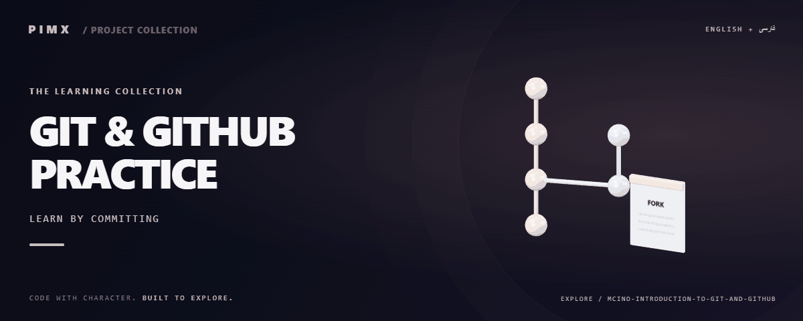

<div align="center">



**[English](README.md) · [فارسی](README.fa.md)**

</div>

<div dir="rtl">

# 🍴 GIT & GITHUB PRACTICE

مخزن forkشده تمرین Git و GitHub با محاسبه بهره و اسناد جامعه منبع اصلی.

[GitHub](https://github.com/MOHAMMADREZAABEDINPOOR/mcino-Introduction-to-Git-and-GitHub) · [PIMX / Profile](https://github.com/MOHAMMADREZAABEDINPOOR) · [بنر ثابت](assets/readme/hero.png)

> این مخزن fork است. مالکیت کد منبع به نویسنده اصلی تعلق دارد؛ نسخه README قبلی در docs/UPSTREAM_README.md نگه داشته شده است.

| نمای کلی | جزئیات |
|:---|:---|
| 🍴 تجربه | تمرین آموزشی / آرشیو کد |
| 🧰 فناوری | `Python` |
| 🌐 زبان راهنما | [English](README.md) · [فارسی](README.fa.md) |

[✨ امکانات](#امکانات) · [🚀 شروع کار](#شروع-کار) · [⚙️ تنظیمات](#تنظیمات) · [🌍 استقرار](#استقرار)

📚 [مستندات اصلی](docs/UPSTREAM_README.md) · [Upstream](https://github.com/MOHAMMADREZAABEDINPOOR)

---

<a id="امکانات"></a>

## ✨ امکانات

| بخش | قابلیت موجود |
|:---|:---|
| ⚡ روند کار | محاسبه بهره ساده در Shell |
| ⚡ روند کار | راهنمای مشارکت |
| ⚡ روند کار | قواعد جامعه |

<a id="پشته-فنی"></a>

## 🧰 پشته فنی

| ابزار | نسخه یا منبع |
|---|---|
| Python | `standard library / source imports` |

<a id="شروع-کار"></a>

## 🚀 شروع کار

Python 3 و محیط دسکتاپ برای پروژه‌های Tkinter/Turtle؛ Tkinter از اجزای نصب Python است و با pip نصب نمی‌شود. برای وابستگی‌های قدیمی از نسخه Python سازگار استفاده کنید.

<div dir="ltr">

```bash
git clone https://github.com/MOHAMMADREZAABEDINPOOR/mcino-Introduction-to-Git-and-GitHub.git
cd mcino-Introduction-to-Git-and-GitHub

bash simple-interest.sh
```

</div>

<a id="تنظیمات"></a>

## ⚙️ تنظیمات

فایل محیط استاندارد تعریف نشده است. برای تمرین‌های مستقل تنظیم خارجی لازم نیست؛ اگر در کد ثابت‌های سرویس یا مسیر وجود دارد، آن‌ها را پیش از اجرا بررسی کنید.

<a id="استفاده"></a>

## 🎯 استفاده

bash simple-interest.sh را اجرا و اصل مبلغ، نرخ سالانه و سال را وارد کنید.

<a id="ساختار-پروژه"></a>

## 🗂️ ساختار پروژه

| مسیر | نقش |
|---|---|
| [`assets/`](assets/) | فایل برند، رسانه و README |
| [`docs/`](docs/) | راهنمای تکمیلی |
| [`compound_interest.py`](compound_interest.py) | فایل ورودی یا تنظیم پروژه |
| [`simple-interest.sh`](simple-interest.sh) | فایل ورودی یا تنظیم پروژه |

<a id="فرمان‌ها-و-بررسی"></a>

## 🧪 فرمان‌ها و بررسی

فرمان آزمون خودکار در manifest تعریف نشده است. اجرای محلی و بررسی رفتار نمونه را انجام دهید.

<a id="استقرار"></a>

## 🌍 استقرار

این تمرین محلی است و سرویس عمومی ندارد. برای تمرین وب میزبانی استاتیک کافی است.

<a id="محدودیت‌ها"></a>

## 📌 محدودیت‌ها

این محاسبه‌گر آموزشی است؛ واحد و نرخ کد را بررسی کنید.

<a id="رفع-مشکل"></a>

## 🛠️ رفع مشکل

- رابط غایب: برای مثال Tkinter یا Turtle از Python دسکتاپ با Tk استفاده کنید.
- ورودی نامعتبر: قالب عدد و متن مورد انتظار فایل را وارد کنید.

<a id="مشارکت"></a>

## 🤝 مشارکت

برای تغییر، شاخه مستقل بسازید، رفتار فعلی را بررسی کنید و توضیح روشن همراه تغییر بفرستید. اطلاعات خصوصی، خروجی build و دیتابیس محلی را commit نکنید.

راهنماهای همراه:

- [CONTRIBUTING.md](CONTRIBUTING.md)
- [docs/UPSTREAM_README.md](docs/UPSTREAM_README.md)

<a id="مجوز"></a>

## 📄 مجوز

متن مجوز در فایل زیر است؛ حقوق منابع و وابستگی‌های شخص ثالث ممکن است متفاوت باشد: [LICENSE](LICENSE).

---

ساخته‌شده در مجموعه **PIMX** · مستندات فارسی و انگلیسی.

---

<div align="center">

🍴 **GIT & GITHUB PRACTICE** · [English](README.md) · [فارسی](README.fa.md)

</div>

</div>
